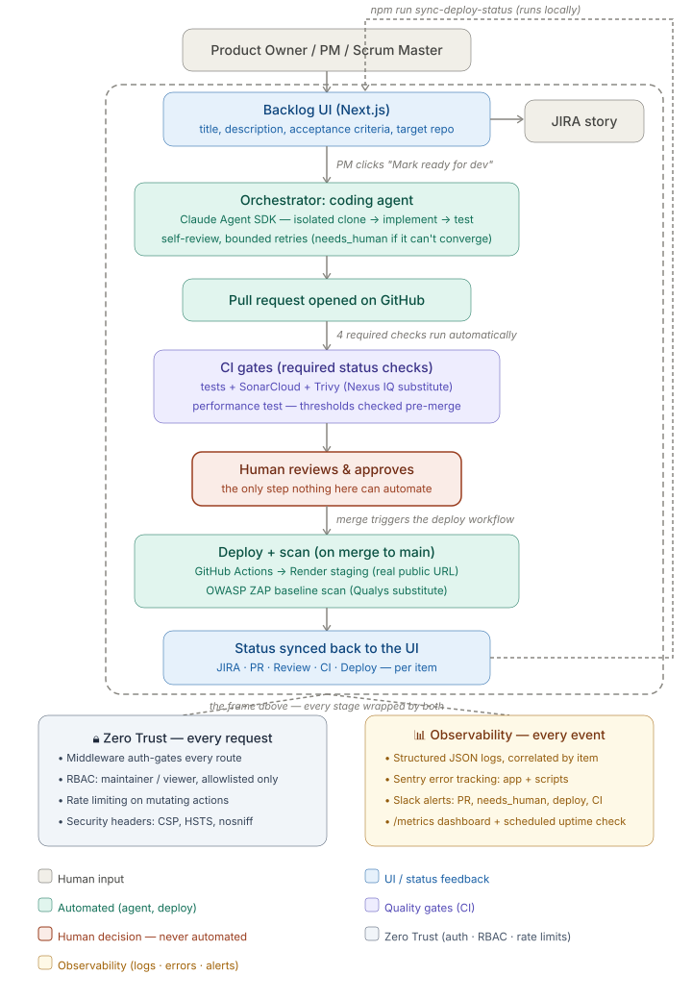
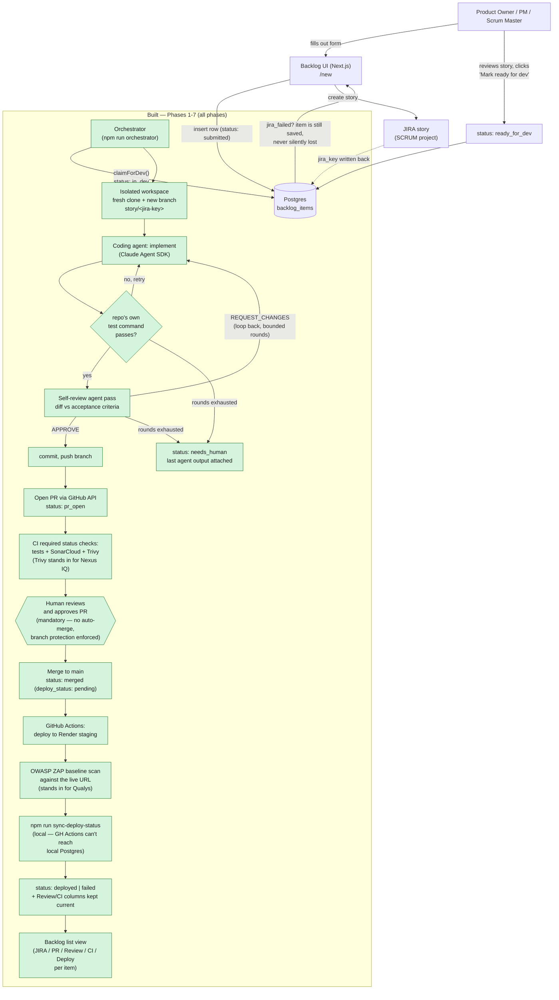

# AI Delivery Pipeline

A reference pipeline: a Product Owner / PM / Scrum Master submits a
backlog item through a small web UI, and everything downstream happens
automatically up to an open pull request — JIRA story creation, an
isolated coding-agent run, a self-review pass, CI (tests + SonarQube +
Nexus IQ), and a staging deploy with a Qualys scan once a human approves
the PR. A human approval gate on every PR is a fixed part of the design,
not a configurable option — see `CLAUDE.md`.

Companion project to [`devops-knowledge-mcp`](../devops-knowledge-mcp) —
reuses some of its patterns (JIRA auth, connector-testing conventions) but
is a separate system with its own repo and lifecycle.

## Status

**All 7 phases are built.** Submitting a backlog item through the web UI
creates a real JIRA story; marking it "ready for dev" and running `npm run
orchestrator` picks it up, runs an isolated Claude Agent SDK
implement/test/self-review loop against the sample repo, and opens a real
PR — see [SCRUM-18 → PR #1](https://github.com/umahanish/delivery-pipeline-sample-app/pull/1)
for the first one. Every PR against the sample repo runs a real CI gate —
tests, a SonarCloud analysis, and a Trivy dependency scan standing in for
Nexus IQ (no license/instance for the real thing exists in this
environment — see `docs/DECISIONS.md`) — as required status checks. On
merge to `main`, a second workflow deploys the sample app to a real
Render.com staging URL and runs an OWASP ZAP baseline scan against it
(standing in for Qualys, same labeled-substitute convention). `npm run
sync-deploy-status` reconciles PR review status, CI results, and deploy
outcome back onto each `backlog_items` row — and into the list view's
**Review**/**CI**/**Deploy** columns — since GitHub's cloud runners can't
reach this project's local Postgres. See `docs/DEMO_SCRIPT.md` for a full
walkthrough, `CLAUDE.md` for the phase-by-phase roadmap, and
`docs/DECISIONS.md` for the reasoning behind every choice made along the
way, including several real bugs (live-run crashes, a test suite that was
silently truncating the real dev database, a branch-protection review
requirement that turned out to be impossible to satisfy on a solo-account
repo) caught by testing this for real rather than trusting green tests
alone.

## End-to-end pipeline

### Task details

Eight stages, read top to bottom in the diagram below:

1. **Product Owner / PM / Scrum Master** — the only human who kicks
   things off. Opens the web UI and fills out a backlog item: what to
   build, why, and how to know it's done.
2. **Backlog UI (Next.js)** — saves the submission and, in the same
   step, creates a matching **JIRA story** so the team's existing
   tracker stays the source of truth. If JIRA is unreachable the
   submission is still saved (never silently lost) and flagged for retry.
3. **Orchestrator: coding agent** — once the PM clicks "Mark ready for
   dev," this is where the AI actually writes code. It clones the target
   repo into its own throwaway workspace (so it can never touch anything
   shared), then loops through implement → run the repo's real test
   suite → self-review against the acceptance criteria, retrying a
   bounded number of times. If it genuinely can't converge, the item is
   flagged `needs_human` with the agent's last output attached — it
   never fails silently.
4. **Pull request opened on GitHub** — the agent's work becomes a normal
   PR, exactly as if a developer had pushed it. Nothing about the next
   two stages is aware the code came from an AI.
5. **CI gates (required status checks)** — the same automated checks any
   team would run: the test suite, a SonarCloud code-quality scan, and a
   dependency vulnerability scan (Trivy). All three must pass before the
   PR can be merged — GitHub enforces this, not a person remembering to check.
6. **Human reviews & approves** — the one box in this whole diagram that
   is deliberately never automated. A person reads the diff and decides.
   No code anywhere in this project is able to click "merge" — that's a
   hard rule, not a setting.
7. **Deploy + scan (on merge to main)** — merging is the trigger. GitHub
   Actions deploys the app to a real staging URL, then runs a security
   scan against the *running* application (not the source code) — this
   is the step most people confuse with the CI scans in step 5, but it's
   structurally different: it can only happen after merge, because
   there's nothing running to scan before that.
8. **Status synced back to the UI** — the loop closes. JIRA status, PR
   review state, CI results, and deploy outcome all get written back
   onto the original backlog item, so the PM can see the whole journey
   from the same screen they started at, without checking four different
   tools.



A PM submits a backlog item → it becomes a real JIRA story → an
autonomous coding agent implements it and opens a PR → CI gates run
automatically → **a human is the only one who can approve the merge** →
merging triggers an automatic staging deploy and security scan → the
result syncs back to the same UI the PM started at. That loop (the
dashed line) is what makes this a pipeline rather than a one-shot script
— every subsequent submission goes through the exact same path.

The only step that is never automated, by design, is the approval box.
No code path in this repo can merge a PR; see the Constraints section of
`CLAUDE.md` and the branch protection (`enforce_admins: true`) on both
the sample app and this repo's own target repos.

<details>
<summary>More detailed technical view (retry loops, exact status values, mocked-vs-real components)</summary>



</details>

## Setup

**Prerequisites:** Docker, Node.js 20+.

```bash
git clone <this repo>
cd ai-delivery-pipeline
npm install
cp .env.example .env

docker compose up -d postgres                                       # Postgres on :5433 (not 5432 — see docker-compose.yml)
npm run migrate                                                     # applies src/db/migrations/ to the dev DB
docker compose exec postgres createdb -U postgres delivery_pipeline_test  # one-time: dedicated test DB
npm run migrate:test                                                # applies the same migrations there
npm test                                                             # runs against TEST_DATABASE_URL only
```

`npm test` truncates `backlog_items`/`pipeline_events` between tests — it
deliberately runs against a **separate** `TEST_DATABASE_URL`, never
`DATABASE_URL`, so it can never wipe real submissions. `tests/helpers/db.ts`
refuses to start if the two URLs match. See `docs/DECISIONS.md`.

### JIRA setup (required for the UI to actually create stories)

Fill in `.env`:

```
JIRA_BASE_URL=https://your-domain.atlassian.net
JIRA_EMAIL=you@example.com
JIRA_API_TOKEN=          # Account Settings -> Security -> API tokens
JIRA_PROJECT_KEY=SCRUM   # the project new stories are created in
JIRA_ISSUE_TYPE=Task     # not every JIRA site has a "Story" issue type — check yours
```

Without these set, the UI still works and still saves every submission —
it just marks the item `jira_failed` instead of creating a story (visible
in the list view), rather than losing the submission. See
`src/lib/createBacklogItem.ts`'s docstring.

### Coding agent + GitHub setup (required for Phase 4+ — the orchestrator)

Fill in `.env`:

```
GITHUB_TOKEN=          # needs repo scope on the target repo -- `gh auth token` works
ANTHROPIC_API_KEY=     # console.anthropic.com -- powers the Claude Agent SDK coding/review passes
```

### Run the UI

```bash
npm run dev
```

Open http://localhost:3000 — submit a backlog item at `/new`, watch it
appear on the list with its JIRA key (or a `jira_failed` badge if JIRA
isn't configured), and use "Mark ready for dev" once a story exists.
There's also a REST API at `/api/backlog-items` (`GET` to list, `POST` to
create) for external/scripted use.

### Run the whole pipeline

```bash
npm run orchestrator          # picks up every ready_for_dev item, implements + opens a PR (or marks needs_human)
npm run sync-deploy-status    # reconciles PR review/CI/merge/deploy status back onto backlog_items -- run any time after a PR exists
```

Neither is a poll daemon — both are one-shot passes, meant to be run
manually, on a schedule, or triggered by a webhook later. See
`docs/DEMO_SCRIPT.md` for a full step-by-step walkthrough of a real run,
start to finish.

### Point this at a different target repo

The target repo is per-backlog-item, not a global setting — just enter a
different repo's URL (or `owner/repo` shorthand) in the **Target repo**
field on the `/new` form, or in a `POST /api/backlog-items` call. The
orchestrator, PR opener, and status reconciliation all derive
owner/repo from that field via `src/github/parseRepo.ts` — no code change
needed here.

What *does* need setting up on the other end, if you want Phases 5-6's
gates to work against it too: that repo needs its own
`.github/workflows/ci.yml` and `deploy.yml` (copy
`delivery-pipeline-sample-app`'s as a starting point), its own
`SONAR_TOKEN`/`RENDER_API_KEY`/`RENDER_SERVICE_ID` secrets, its own
`sonar-project.properties`, and branch protection requiring those checks
— none of that lives in this repo or in `.env`. Without it, Phase 4 still
works (the agent will implement and open a PR against any repo with the
right `GITHUB_TOKEN` scope) — you just won't get CI/deploy gating on it.

## Project layout

```
src/
  db/            schema.sql, migrations/, pool.ts, backlogItems.ts (data access)
  jira/          client.ts (create-issue only, not a full connector), adf.ts (text -> Atlassian Document Format), fromEnv.ts
  lib/           createBacklogItem.ts — the one place "insert row, then create JIRA story" logic lives
  agent/         runCodingAgent.ts (Claude Agent SDK wrapper), prompts.ts (implement/fix/self-review prompt building)
  github/        client.ts (PR creation, merge/review/CI-status checks), parseRepo.ts
  orchestrator/  git.ts, workspace.ts, processBacklogItem.ts (Phase 4's implement/test/review loop), deployStatus.ts (Phase 6-7's reconciliation)
  app/           Next.js App Router: page.tsx (list), new/page.tsx (form), actions.ts (Server Actions), api/backlog-items/route.ts (REST)
scripts/         migrate.ts, migrate-test.ts, run-orchestrator.ts, sync-deploy-status.ts
docs/
  DECISIONS.md    every judgment call, including bugs found while building
  DEMO_SCRIPT.md  a full end-to-end walkthrough
```

## Development

```bash
npm run typecheck   # tsc --noEmit, strict mode
npm test             # vitest — tests/db and tests/lib need Postgres running
npm run build         # next build — the real check that everything actually resolves; see docs/DECISIONS.md on why typecheck alone wasn't enough
```
