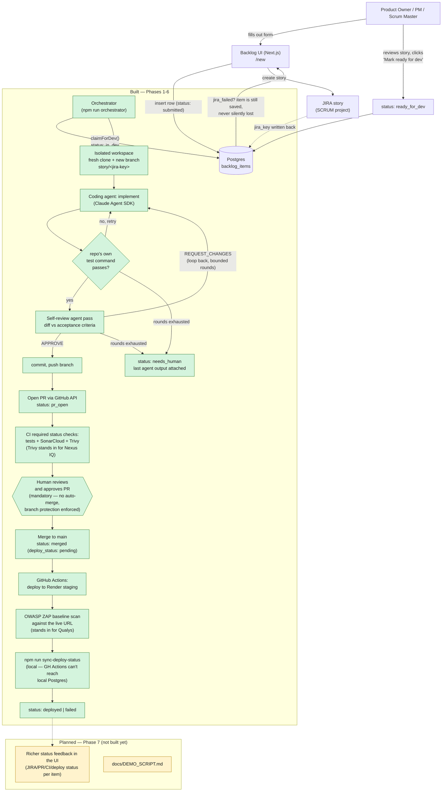

# AI Delivery Pipeline

A reference pipeline: a Product Owner / PM / Scrum Master submits a
backlog item through a small web UI, and everything downstream happens
automatically up to an open pull request — JIRA story creation, an
isolated coding-agent run, a self-review pass, CI (tests + SonarQube +
Nexus IQ), and a staging deploy with a Qualys scan once a human approves
the PR. A human approval gate on every PR is a fixed part of the design,
not a configurable option — see `CLAUDE.md`.

Companion project to [`devops-knowledge-mcp`](../devops-knowledge-mcp) —
reuses some of its patterns (JIRA auth, connector-testing conventions) but
is a separate system with its own repo and lifecycle.

## Status

**Built so far: Phase 1 (foundations), Phase 2 (sample target repo —
[`delivery-pipeline-sample-app`](https://github.com/umahanish/delivery-pipeline-sample-app)),
Phase 3 (backlog UI → JIRA), Phase 4 (the coding agent orchestrator),
Phase 5 (CI on the PR), and Phase 6 (staging deploy + a Qualys-substitute
scan) — proven end to end with real live runs, not just mocked tests.**
Submitting a backlog item through the web UI creates a real JIRA story;
marking it "ready for dev" and running `npm run orchestrator` picks it up,
runs an isolated Claude Agent SDK implement/test/self-review loop against
the sample repo, and opens a real PR — see [SCRUM-18 → PR #1](https://github.com/umahanish/delivery-pipeline-sample-app/pull/1)
for the first one. Every PR against the sample repo now also runs a real
CI gate — tests, a SonarCloud analysis, and a Trivy dependency scan
standing in for Nexus IQ (no license/instance for the real thing exists in
this environment — see `docs/DECISIONS.md`) — as required status checks;
see [PR #2](https://github.com/umahanish/delivery-pipeline-sample-app/pull/2)
for that workflow's own first (passing) run. On merge to `main`, a second
workflow deploys the sample app to a real Render.com staging URL and runs
an OWASP ZAP baseline scan against it (standing in for Qualys, same
labeled-substitute convention — see [PR #3](https://github.com/umahanish/delivery-pipeline-sample-app/pull/3));
`npm run sync-deploy-status` reconciles the result back onto the
`backlog_items` row locally, since GitHub's cloud runners can't reach this
project's local Postgres. Phase 7 (richer status feedback in the UI,
demo script) is not started — see `CLAUDE.md` for the full roadmap and
`docs/DECISIONS.md` for the reasoning behind every choice made so far,
including several real bugs (two live-run crashes and their fixes, a test
suite that was silently truncating the real dev database) caught by
testing this for real rather than trusting green tests alone.

## End-to-end pipeline



The only step that is never automated, by design, is the approval gate —
`GATE` above. No code path in this repo can merge a PR; see the
Constraints section of `CLAUDE.md` and the branch protection
(`enforce_admins: true`) on both the sample app and this repo's own
target repos.

## Setup

**Prerequisites:** Docker, Node.js 20+.

```bash
git clone <this repo>
cd ai-delivery-pipeline
npm install
cp .env.example .env

docker compose up -d postgres                                       # Postgres on :5433 (not 5432 — see docker-compose.yml)
npm run migrate                                                     # applies src/db/migrations/ to the dev DB
docker compose exec postgres createdb -U postgres delivery_pipeline_test  # one-time: dedicated test DB
npm run migrate:test                                                # applies the same migrations there
npm test                                                             # 50 tests — runs against TEST_DATABASE_URL only
```

`npm test` truncates `backlog_items`/`pipeline_events` between tests — it
deliberately runs against a **separate** `TEST_DATABASE_URL`, never
`DATABASE_URL`, so it can never wipe real submissions. `tests/helpers/db.ts`
refuses to start if the two URLs match. See `docs/DECISIONS.md`.

### JIRA setup (required for the UI to actually create stories)

Fill in `.env`:

```
JIRA_BASE_URL=https://your-domain.atlassian.net
JIRA_EMAIL=you@example.com
JIRA_API_TOKEN=          # Account Settings -> Security -> API tokens
JIRA_PROJECT_KEY=SCRUM   # the project new stories are created in
JIRA_ISSUE_TYPE=Task     # not every JIRA site has a "Story" issue type — check yours
```

Without these set, the UI still works and still saves every submission —
it just marks the item `jira_failed` instead of creating a story (visible
in the list view), rather than losing the submission. See
`src/lib/createBacklogItem.ts`'s docstring.

### Run it

```bash
npm run dev
```

Open http://localhost:3000 — submit a backlog item at `/new`, watch it
appear on the list with its JIRA key (or a `jira_failed` badge if JIRA
isn't configured), and use "Mark ready for dev" once a story exists.
There's also a REST API at `/api/backlog-items` (`GET` to list, `POST` to
create) for external/scripted use.

## Project layout

```
src/
  db/            schema.sql, migrations/, pool.ts, backlogItems.ts (data access)
  jira/          client.ts (create-issue only, not a full connector), adf.ts (text -> Atlassian Document Format), fromEnv.ts
  lib/           createBacklogItem.ts — the one place "insert row, then create JIRA story" logic lives
  app/           Next.js App Router: page.tsx (list), new/page.tsx (form), actions.ts (Server Actions), api/backlog-items/route.ts (REST)
scripts/         migrate.ts
docs/
  DECISIONS.md   every judgment call, including bugs found while building
```

## Development

```bash
npm run typecheck   # tsc --noEmit, strict mode
npm test             # vitest — tests/db and tests/lib need Postgres running
npm run build         # next build — the real check that everything actually resolves; see docs/DECISIONS.md on why typecheck alone wasn't enough
```
